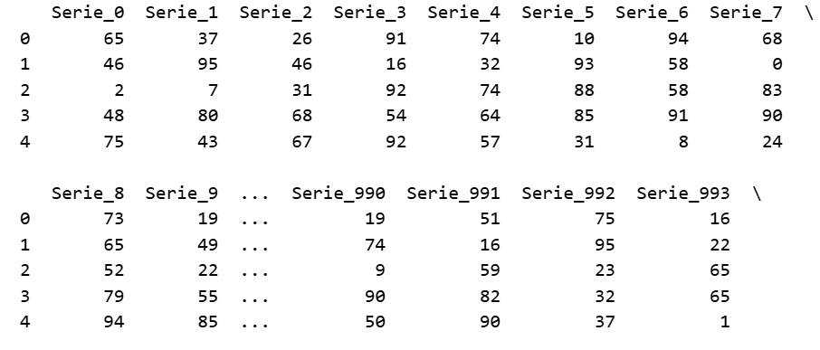
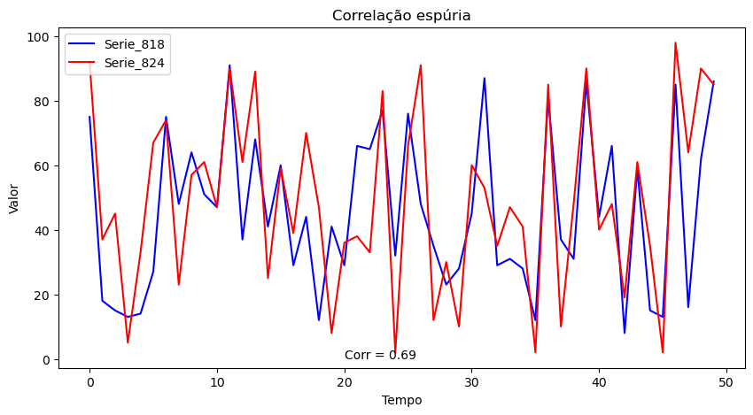

# Series_aleatorias
Código para gerar séries aleatórias e calcular correlações

Este código gera 1000 séries aleatórias de 50 valores cada.

E depois, calcula a correlação entre as séries. Algumas terão alta correlação, outras baixas.

Daí, o código pega as duas séries com maior correlação e plota o resultado.

A intenção deste exercício é mostrar correlações espúrias, e evitar a "picaretagem de dados".

